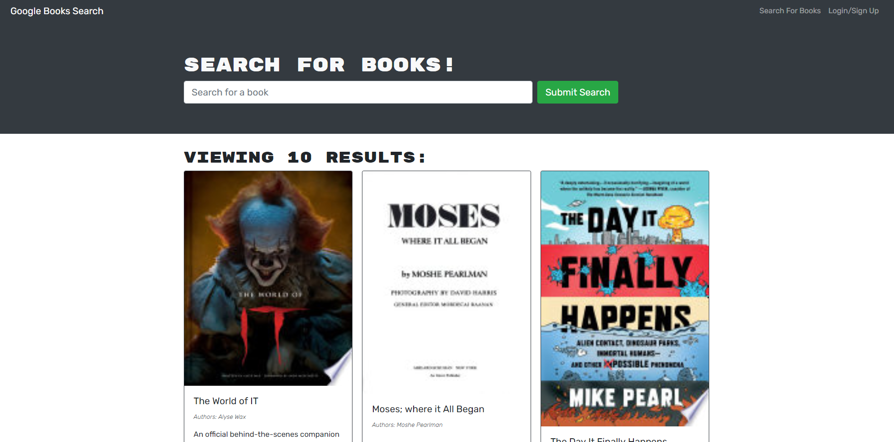

# book-search-engine

## Table of contents

- [Description](#description)
- [Deployed Site](#deployed-site)
- [Screenshots](#screenshots)
- [Installation](#installation)
- [Tech](#tech)
- [Contributions](#contributions)
- [Github](#github)
- [Contact](#contact)
- [License](#license)


## Description
The Book search engine is an application using React, MongoDB, Node, and Express, Apollo and Graphql. It allows users to sign up, log in, search for books and save books to their username. Users can also delete saved books from their saved books page. 

## Deployed Site
  
  <https://obscure-atoll-74098.herokuapp.com/>

## Screenshots



 ## User Story
  
  ```md
  AS AN avid reader
  I WANT to search for new books to read
  SO THAT I can keep a list of books to purchase
  ```


## Installation
This application requires the installment of 'express', 'mongoose, 'graphql', 'react', and 'apollo'. Please run:
  ```
      npm i
      npm i graphql
  ```
 


## Tech

- VS Code
- Node.js
- MongoDB
- React
- Apollo
- Graphql

## Contributions

This project was made with help from:

* UNCC BootCamp class
* My tutor, Josh Furlin

## Github
Below is the link to the github repository for this project

<https://github.com/jessgreene9/book-search-engine>

## Contact

    
For any questions about this project, please visit my GitHub page: [GitHub Profile](https://github.com/jessgreene9)
      
Or email me at: [Jess Greene](mailto:jess.greene9@gmail.com)


## License

[](https://opensource.org/licenses/MIT)